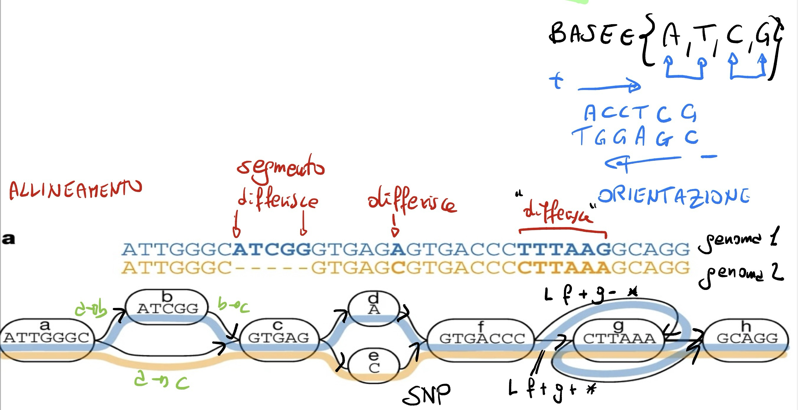

## Progetto per Algoritmi e Strutture Dati (a.a. 2023/2024): Creazione e Analisi di un Pangenome Graph

- [Pagina del corso 📘](https://didawiki.cli.di.unipi.it/doku.php/matematica/asd/asd_23/start)
- [Pagina del progetto 📑](https://didawiki.cli.di.unipi.it/doku.php/matematica/asd/asd_23/progetto_21)

Il progetto riguarda la costruzione e l'analisi di un pangenome graph, che permette di rappresentare e analizzare variazioni genetiche all'interno di un insieme di genomi in bioinformatica. Utilizzando il formato **GFA** (Graphical Fragment Assembly), il progetto richiede di leggere file GFA e creare un grafo etichettato, nonché di eseguire diverse operazioni su di esso.

### Obiettivi del Progetto

1. **Lettura e Creazione del Grafo:**
   * Leggere un file GFA e creare un grafo *G* etichettato e orientato, utilizzando le liste di adiacenza (`vector` in C++).
   * Etichettare i nodi e gli archi di *G* in base alle informazioni fornite nel file GFA.

2. **Analisi del Grafo:**
   * Verificare se il grafo *G* sia ciclico: in tal caso effettuare una visita DFS e rimuovere gli archi all'indietro (*back edge*) in modo che *G* diventi un DAG (directed acyclic graph). 
   * Considerare una sorgente *s* (grado d'ingresso a zero) a una destinazione *t* (grado d'uscita a zero). Se ci sono più sorgenti o destinazioni, selezionarne una specifica per l'analisi.

3. **Ricerca di Pattern sui Cammini del DAG:**
   * Eseguire una ricerca in profondità (DFS) nel DAG *G* a partire dalla sorgente *s* per trovare tutti i cammini che partono da *s* e arrivano in *t*.
   * Attenzione che il numero di tali cammini può essere esponenziale, per cui verificare questo solo su un DAG piccolo. 
   * Ignorare l'array booleano "visitato" poiché il grafo è aciclico e usare un array *S* di caratteri di appoggio: modificare la visita ricorsiva DFS vista a lezione, in modo da aggiungere e rimuovere la stringa del nodo corrente *u* nella DFS quando, rispettivamente, *u* viene visitato per la prima volta e quando la visita in *u* termina. (Nota: quando *u=t*, la sequenza corrispondente al cammino attuale da *s* a *t* si trova in *S*.)
   * Data una sequenza pattern *P* di lunghezza *K*, verificare se è contenuta in una delle sequenze generate come sopra. In tal caso, *P* è chiamata *K-mer*.
   * Utilizzare tecniche di rolling hash per calcolare l'hash delle porzioni di lunghezza *K* nella sequenza (hash visto a lezione) e confrontarle con l'hash del pattern *P*. 

4. **Facoltativo: Calcolo delle Frequenze dei K-mer:**
   * Calcolare la frequenza di ogni K-mer in un pangenome graph *G*, definita come il numero delle sue occorrenze. Ad esempio, per *P = ATA*, la frequenza è 2.
   * Riportare i 10 K-mer più frequenti in *G*.

### Riferimenti
  * Documentazione del formato GFA: http://gfa-spec.github.io/GFA-spec/GFA1.html
  * Dataset: [example.gfa](https://github.com/jltsiren/gbwt-rs/blob/main/test-data/example.gfa), [DRB1-3123_unsorted.gfa](https://github.com/pangenome/odgi/blob/master/test/DRB1-3123_unsorted.gfa)
